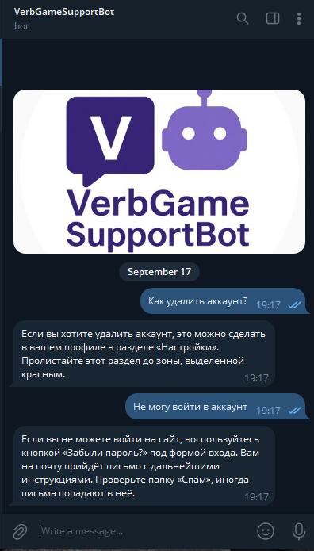
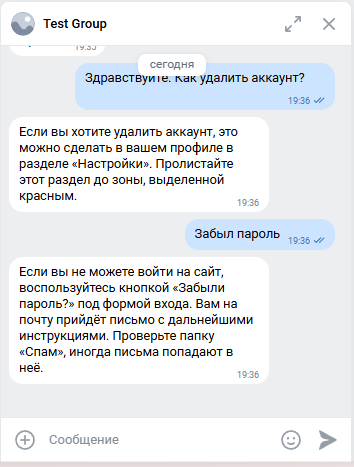

# VerbGameSupportBot


## Описание
VerbGameSupportBot - это набор скриптов на Python для управления чат-ботами технической поддержки в [Телеграм](https://telegram.org) и [Вконтакте](https://vk.ru).

Состоит из трёх основных скриптов:
- [telegram_bot](#telegram_bot)
- [vk_bot](#vk_bot)
- [dialog_flow_learning](#dialog_flow_learning)

## Требования
- Python 3.10
- python-telegram-bot 13.15
- google-cloud-dialogflow 2.41
- vk_api 11.10
- environs 14

## Установка
1. В папке проекта создайте виртуальное окружение:
    ```
    python -3.10 -m venv venv
    ```
2. Установите зависимости:
    ```bash
    pip install -r requirements.txt
    ```
#### Настройка Dialogflow
3. Создайте проект в Google Cloud:
    - Откройте [Google Cloud Console](https://console.cloud.google.com/)
    - В верхней панели нажмите на список проектов → New Project или [создайте новый проект](https://console.cloud.google.com/projectcreate):
      - Project name - название для проекта (например, VerbGame Support)
      - Location - No organization (если не в организации)
    - После создания проекта скопируйте его `Project ID` - он понадобится при [настройке `.env`](#настройка-env)
4. Включите Dialogflow API:
    - Перейдите на [включение Dialogflow API](https://console.cloud.google.com/flows/enableapi?apiid=dialogflow.googleapis.com)
    - Убедитесь, что выбран ваш новый проект (в правом верхнем углу)
    - Нажмите `Enable`
5. Создайте агента Dialogflow ES:
    - Перейдите в [Dialogflow Console (ES)](https://dialogflow.cloud.google.com/)
    - В левом меню нажмите `Create Agent`
    - Заполните поля:
      - Agent name - любое имя (например, VerbGame Support)
      - Google Project - выберите созданный ранее проект
      - Default language - Russian (ru)
      - Default time zone - ваш часовой пояс
    - Нажмите `Create` - агент будет привязан к вашему проекту GCP
    - Проверка, что агент создан именно в нужном проекте:
      - Settings → вкладка General → поле `Project ID` должно совпадать с вашим `DIALOG_FLOW_PROJECT_ID`
6. Создайте сервисный аккаунт и скачайте `credentials.json`:
    - Перейдите в [IAM & Admin → Service Accounts](https://console.cloud.google.com/iam-admin/serviceaccounts)
    - Нажмите `Create Service Account`:
      - Service account name - например, `dialogflow-bot`
    - Нажмите `Create and continue`, назначьте роли:
      - `Dialogflow Service Agent` - для работы бота (detectIntent)
      - `Editor` (опционально) - если планируете создавать/редактировать интенты скриптом [dialog_flow_learning]()
    - Нажмите `Done`
    - Скачайте ключ `.json`:
      - В списке сервисных аккаунтов откройте созданный → вкладка Keys → Add key → Create new key → JSON
      - Скачанный файл положите в корень проекта, например:
        ```
        ./credentials.json
        ```
    - Добавьте путь к файлу `credentials.json` в [`.env`](#настройка-env)
7. Создайте базовые интенты с помощью скрипта [dialog_flow_learning](), либо вручную:
    - Перейдите в [Dialogflow Console (ES)](https://dialogflow.cloud.google.com/)
    - В левом меню выберите `Intents` → Create Intent
    - Укажите название интента (например, Приветствие)
    - Добавьте `Training phrases` - варианты вопросов пользователей
    - Добавьте `Responses` - текст, который бот должен отвечать
    - Нажмите `Save`
#### Создание и настройка телеграм-бота
8. Создайте телеграм-бота и получите его токен:
    - Откройте Telegram и найдите бота по имени: `@BotFather`
    - Напишите ему команду `/start` (если ранее не общались)
    - Отправьте `/newbot` для создания нового бота
    - BotFather попросит ввести имя бота:
        - Пример: `VerbGame Support Bot`
    - Затем попросит ввести юзернейм бота (должен заканчиваться на `bot`):
        - Пример: `VerbGameSupportBot`
    - После успешного создания BotFather вернёт вам токен вашего бота. Он будет в формате:
        - `123456789:ABC-DEF1234ghIkl-zyx57W2v1u123ew11`
        - Этот токен необходимо [сохранить в `.env`](#настройка-env)
9. Получите свой `chat_id`:
    - Отправьте любое сообщение боту `@userinfobot` в Телеграм
    - В ответном сообщении будет ваш `chat_id` в формате:
        - `123456789`
        - Этот id необходимо [сохранить в `.env`](#настройка-env)
#### Создание и настройка бота во ВКонтакте (VK API)
10. Создайте сообщество:
    - Перейдите на [страницу создания сообщества](https://vk.com/groups_create)
    - Выберите тип `Публичная страница` или `Бизнес` - подойдёт любой (лучше 'Бизнес')
    - Укажите:
      - Название (например, VerbGame Support)
      - Тематику - любая подходящая
11. Включите бота в сообществе:
    - Перейдите в настройки сообщества:
      - [Управление → Сообщения](https://vk.com/clubXXXXXXX?act=messages) (замените XXXXXXX в ссылке на ID вашего сообщества)
    - Включите:
      - `Сообщения сообщества` - Включены
      - `Бот` - Включён
      - `API для ботов` - Включено
    - Перейдите в [Настройки → Работа с API → Long Poll API](https://vk.com/clubXXXXXXX?act=api&section=longpoll) (замените XXXXXXX в ссылке на ID вашего сообщества)
      - Включите `Long Poll API`
      - Выберите версию API (например, 5.199)
      - В разделе `Типы событий` включите хотя бы `Входящие сообщения` (message_new)
12. Создайте токен доступа:
    - Перейдите в [Настройки → Работа с API → Ключи доступа](https://vk.com/clubXXXXXXX?act=api&section=access) (замените XXXXXXX в ссылке на ID вашего сообщества)
    - Нажмите `Создать ключ`
    - В появившемся окне выберите права:
      - Сообщения
      - Управление сообществом
    - Нажмите `Создать`
    - Скопируйте полученный токен - он нужен для [настройки `.env`](#настройка-env)

#### Настройка `.env`
13. Создайте и настройте файл `.env`:
    ```env
    TG_BOT_TOKEN=1234567890:QWEtryhdj_Fjdfyeu...  # Токен телеграм-бота
    VK_BOT_TOKEN=vk1.a.LKJDGOIJHGERKGHSLIKRGQ...  # Токен ВК-бота
    DIALOG_FLOW_PROJECT_ID=your_project_id        # ID проекта Dialogflow
    GOOGLE_CREDENTIALS_PATH=./credentials.json    # Путь к файлу сервисного ключа Dialogflow
    TG_CHAT_ID=123456789                          # ID Телеграм-чата, в который бот будет дублировать логи с ошибками
    ```


## Структура проекта
```
VerbGameSupportBot/
├─ .env                     # Файл настроек
├─ telegram_bot.py          # Телеграм-бот
├─ vk_bot.py                # ВК-бот
├─ dialog_flow_learning.py  # Скрипт автоматического создания интентов Dialogflow
├─ credentials.json         # Файл сервисного ключа Dialogflow
├─ questions.json           # Файл с тренировочными фразами
└─ requirements.txt         # Зависимости
```
--------------------------------------------
--------------------------------------------

# telegram_bot

## Описание
**telegram_bot** - это бот-помощник службы поддержки в мессенджере [Телеграм](https://telegram.org).

## Основные функции:
Бот отвечает на вопросы пользователей, используя предобученные интенты из Dialogflow ES.
Если сработал Fallback Intent (незнакомая фраза), бот ничего не отвечает, давая возможность оператору перехватить диалог.
Параллельная обработка сообщений разных пользователей. Дублирование логов с ошибками в Телеграм.

## Запуск
```bash
python telegram_bot.py
```

## Пример работы

```log
2025-09-17 19:16:37,204 | INFO | tg-bot | Loaded service account: dialogflow-bot@aaaaaaaa.iam.gserviceaccount.com
2025-09-17 19:16:37,205 | INFO | tg-bot | Telegram bot started. Listening for messages...
2025-09-17 19:16:37,205 | INFO | apscheduler.scheduler | Scheduler started
WARNING: All log messages before absl::InitializeLog() is called are written to STDERR
E0000 00:00:1758111447.496267    6968 alts_credentials.cc:93] ALTS creds ignored. Not running on GCP and untrusted ALTS is not enabled.
2025-09-17 19:17:28,576 | INFO | tg-bot | DF matched intent: Удаление аккаунта | fallback=False | conf=1.000 | text='Как удалить аккаунт?'
E0000 00:00:1758111472.833746    6968 alts_credentials.cc:93] ALTS creds ignored. Not running on GCP and untrusted ALTS is not enabled.
2025-09-17 19:17:53,557 | INFO | tg-bot | DF matched intent: Забыл пароль | fallback=False | conf=1.000 | text='Не могу войти в аккаунт'
```
--------------------------------------------
--------------------------------------------

# vk_bot

## Описание
**vk_bot** - это бот-помощник службы поддержки в социальной сети [Вконтакте](https://vk.ru).

## Основные функции:
Бот отвечает на вопросы пользователей отслеживания новые сообщения в сообществе и используя предобученные интенты из Dialogflow ES.
Если сработал Fallback Intent (незнакомая фраза), бот ничего не отвечает, давая возможность оператору перехватить диалог.
Параллельная обработка сообщений разных пользователей. Дублирование логов с ошибками в Телеграм.

## Запуск
```bash
python vk_bot.py
```

## Пример работы

```log
2025-09-17 19:35:40,365 | INFO | vk-bot | Loaded service account: dialogflow-bot@aaaaaa.iam.gserviceaccount.com
2025-09-17 19:35:41,148 | INFO | vk-bot | VK bot started. Listening for messages...
WARNING: All log messages before absl::InitializeLog() is called are written to STDERR
E0000 00:00:1758112598.015186   17964 alts_credentials.cc:93] ALTS creds ignored. Not running on GCP and untrusted ALTS is not enabled.
2025-09-17 19:36:38,906 | INFO | vk-bot | Dialogflow matched intent: Удаление аккаунта | fallback=False | conf=1.000 | text='Здравствуйте. Как удалить аккаунт?'
E0000 00:00:1758112614.370280   17964 alts_credentials.cc:93] ALTS creds ignored. Not running on GCP and untrusted ALTS is not enabled.
2025-09-17 19:36:55,166 | INFO | vk-bot | Dialogflow matched intent: Забыл пароль | fallback=False | conf=1.000 | text='Забыл пароль'
```
--------------------------------------------
--------------------------------------------

# dialog_flow_learning

## Описание
**dialog_flow_learning** - это автоматизированный скрипт на Python для создания интентов в [Dialogflow Console (ES)](https://dialogflow.cloud.google.com/).

## Основные функции:
Скрипт использует [Dialogflow (ES)](https://dialogflow.cloud.google.com/) и библиотеку `google-cloud-dialogflow` для автоматического создания интентов в агенте на основе данных из questions.json. Использует ключ сервисного аккаунта `questions.json` с ролью `Editor`.

## Запуск
- Убедитесь, что файл `questions.json` находится в папке проекта и имеет сделующий вид:
  ```json
  {
      "Устройство на работу": {
          "questions": [
              "Как устроиться к вам на работу?",
              "Как устроиться к вам?",
              "Как работать у вас?",
              "Хочу работать у вас",
              "Возможно-ли устроиться к вам?",
              "Можно-ли мне поработать у вас?",
              "Хочу работать редактором у вас"
          ],
          "answer": "Если вы хотите устроиться к нам, напишите на почту game-of-verbs@gmail.com мини-эссе о себе и прикрепите ваше портфолио."
      },
      "Забыл пароль": {
          "questions": [
              "Не помню пароль",
              "Не могу войти",
              "Проблемы со входом",
              "Забыл пароль",
              "Забыл логин",
              "Восстановить пароль",
              "Как восстановить пароль",
              "Неправильный логин или пароль",
              "Ошибка входа",
              "Не могу войти в аккаунт"
          ],
          "answer": "Если вы не можете войти на сайт, воспользуйтесь кнопкой «Забыли пароль?» под формой входа. Вам на почту прийдёт письмо с дальнейшими инструкциями. Проверьте папку «Спам», иногда письма попадают в неё."
      }
  }
  ```
- Задайте нужные имена полям в dialog_flow_learning.py:
  ```python
  INTENT_DISPLAY_NAME = 'Удаление аккаунта' # Имя интента
  JSON_SECTION_KEY = 'Удаление аккаунта'    # Имя поля в questions.json
  ```
- Запустите скрипт:
  ```bash
  python dialog_flow_learning.py
  ```

## Пример работы
```log
WARNING: All log messages before absl::InitializeLog() is called are written to STDERR
E0000 00:00:1758114189.950621   18892 alts_credentials.cc:93] ALTS creds ignored. Not running on GCP and untrusted ALTS is not enabled.
E0000 00:00:1758114189.954960   18892 alts_credentials.cc:93] ALTS creds ignored. Not running on GCP and untrusted ALTS is not enabled.
Intent created: Устройство на работу
```

## ToDo
- [ ] Добавить логирование в файл с ротацией.
- [ ] Реализовать боту интерфейс паузы для корректного перехвата диалога оператором.
- [ ] Добавить в dialog_flow_learning функционал парсинга датасета и создания множества интентов.
## Цели проекта

Код написан в учебных целях - для курса по Python и веб-разработке на сайте [Devman](https://dvmn.org).